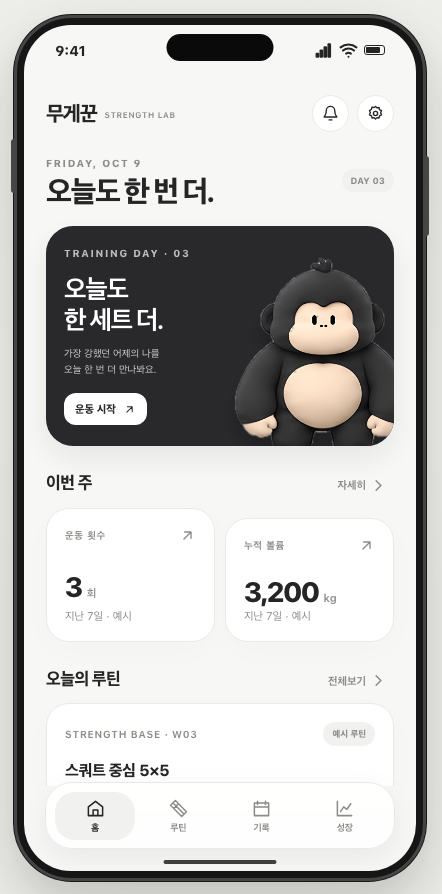
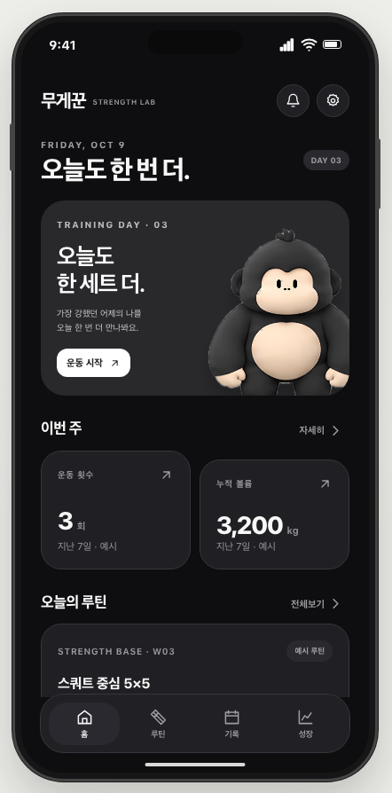
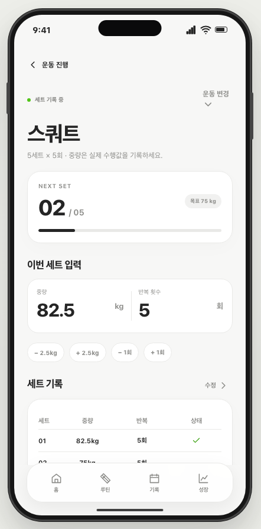

# 무게꾼 UX Studio — 인터랙티브 전체 화면 목업

> 상태: **UX 1차 디자인 검토용 / 디자인 토큰 미확정 / RealityKit 미적용**

차콜 `#2A2A2A`과 흰색 계열을 중심으로 한 Light/Dark 앱 목업입니다. 색상·타이포그래피·여백·카드 규칙은 확정된 디자인 토큰이 아니라 수정 가능한 시안입니다.

## 실행

Mac에서 아래 파일을 Chrome 또는 Safari로 여세요. 서버·빌드·로그인이 필요하지 않습니다.

```bash
open docs/MUGEKKUN_UI_STUDIO/index.html
```

왼쪽의 45개 화면 목록에서 이동하거나 iPhone 모형 안의 버튼을 직접 클릭할 수 있습니다. 오른쪽 화면 검토창에 개선 의견을 입력하고 **의견 저장** 후 **전체 화면 피드백 내보내기**를 누르면 `MUGEKKUN_UI_REVIEW.md` 파일로 다운로드됩니다.

- 화면별 피드백은 사용 중인 브라우저의 localStorage에 저장됩니다. 다른 브라우저로 자동 공유되지 않습니다.
- 실제 운동 기록은 변경하지 않습니다. 앱, 데이터베이스, Apple 로그인, 백업, 외부 API에 연결하지 않습니다.
- 카드 수치/기간/샘플 연구 메모는 디자인용 가상 데이터이며 실제 검증 결과가 아닙니다.
- 릴라는 사용자 선택 3D 포스터의 4× 이미지 시안이고 현재는 정적 이미지입니다. **RealityKit 작업은 디자인 승인 후 진행합니다.**
- 사용자 소유의 `docs/UX_WIREFRAME.html`은 수정하지 않았습니다.

## 화면 미리보기

| Light 홈 | Dark 홈 | 세트 입력 |
|---|---|---|
|  |  |  |

전체 화면과 하위 내비게이션은 **[index.html](index.html)**을 브라우저로 열어 확인해야 합니다.

## 핵심 검토 흐름

```text
첫 실행 → 소개 → 목표 → 경험 → 종목 → 출발 중량 → 저장 방식 → 준비 완료 → 홈
홈 → 루틴 탐색 → 루틴 상세 → 연구 근거 / 주간 일정 → 시작 확인
시작 확인 → 세션 개요 → 세트 입력 → 완료 → 휴식 타이머 → 다음 세트 → 운동 완료
운동 기록 → 날짜별 조회 / 기록 상세 / 수정 / 수동 기록
성장 → 종목별 e1RM / 실측 1RM / 분석 방법 / 프로토콜 리포트 / 릴라 성장
설정 → 프로필 / 테마 / 단위 / 알림 / 데이터 / 계정 / 앱 정보
```

## 화면 목록 (총 45개)

### 첫 사용·온보딩

- `splash` — 첫 실행
- `welcome` — 서비스 소개
- `setup-goal` — 운동 목표
- `setup-level` — 운동 경험
- `setup-lifts` — 관심 종목
- `setup-baseline` — 현재 중량
- `setup-mode` — 데이터 보관
- `setup-ready` — 준비 완료

### 홈

- `home` — 홈 대시보드
- `notifications` — 알림 센터
- `daily-insight` — 오늘의 인사이트

### 루틴·운동 상세

- `routines` — 루틴 탐색
- `routine-search` — 루틴 검색
- `routine-detail` — 루틴 상세
- `routine-evidence` — 연구 근거
- `routine-schedule` — 주간 일정
- `routine-custom` — 나의 루틴 편집
- `routine-confirm` — 운동 시작 확인
- `exercise-info` — 운동 종목 상세

### 운동 중

- `session-overview` — 진행 중 운동
- `session-exercise` — 세트 입력
- `session-rest` — 휴식 타이머
- `session-edit-set` — 세트 수정
- `session-swap` — 운동 변경
- `session-end-confirm` — 종료 확인
- `session-summary` — 운동 완료

### 운동 기록

- `records` — 기록 목록
- `records-calendar` — 기록 캘린더
- `records-detail` — 기록 상세
- `records-edit` — 과거 기록 수정
- `record-new` — 수동 기록

### 성장·분석

- `growth` — 성장 대시보드
- `growth-lift` — 종목별 추이
- `growth-max` — 실측 1RM
- `growth-experiment` — 프로토콜 리포트
- `growth-lila` — 릴라 성장
- `growth-insight` — 분석 방법

### 설정·데이터

- `settings` — 설정 홈
- `settings-profile` — 내 프로필
- `settings-theme` — 화면 테마
- `settings-units` — 중량 단위
- `settings-notices` — 알림 설정
- `settings-data` — 데이터 관리
- `settings-account` — 계정·동기화
- `settings-about` — 앱 정보

## 디자인 승인 전 확인할 요소

1. 화면별 정보 밀도와 시각적 우선순위(홈 대시보드/운동 중 숫자 입력/성장 그래프)
2. 라이트·다크 기본값, 배경 무채색 톤, 차콜 색상
3. 카드의 수·크기·여백·모서리 반경
4. 하단 탐색 및 인앱 뒤로 가기 흐름
5. 근거 페이지의 검증 표시와 개인 데이터 표현
6. 릴라 이미지 노출량, RealityKit에 전달할 슬롯 크기

화면 검토 후 이 항목을 수정하고, 마지막에 코드 수준의 디자인 토큰을 확정합니다.

## 구현/기술 경계

- 순수 HTML/CSS/JavaScript 목업. 실제 SwiftUI 앱과 기능적으로 연결되어 있지 않습니다.
- 실서비스 자료는 `docs/RFP.md` 기준으로 다시 검증합니다.
- 연구 출처나 1RM 수치를 목업 값에서 실제 값으로 자동 승격하지 않습니다.
- 앱용 3D 캐릭터는 RealityKit 도입 단계에서 별도 품질 게이트를 통과해야 합니다.
